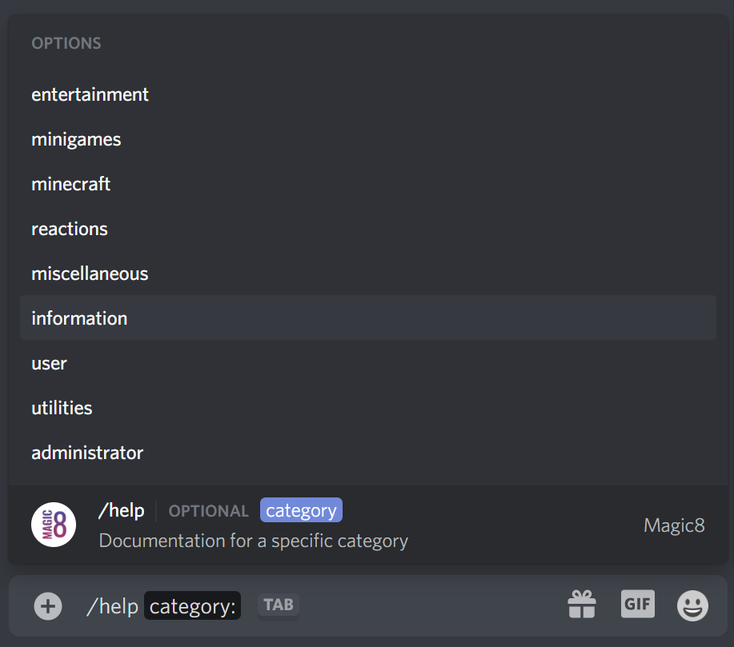

# Change Log - January 2021

The following list of updates are from the month of `January 2021`. To view other updates, open the **Change Log** tab on the left.

## 1/24/2021 - Live

**New**

* The dates in `language` menus now will attempt to grab the date format of the server's language
* Certified on [**Blist**](https://blist.xyz/bot/484148705507934208)\*\*\*\*
* Magic8 is officially a part of [**BreMea Development**](http://bremea.com/) / [**Cube Club**](https://discord.gg/9jn6AFZxja)\*\*\*\*
* \*\*\*\*[**magic8.xyz**](https://magic8.xyz) properly redirects to the documentation
* Statuses
* `partners` command to view the new [**Partners**](../partners/) page
* Updated `vote` command menu

**Changes**

* `impostor` is now an alias of `imposter`
* Option to @mention a user for `imposter` to get their name in the image/title
* The issue of username with spaces when using `imposter` was fixed
* Typing `media` when there is no media set no longer requires `Manage Server` permission
* Typing `help <command>` no longer requires `Manage Server` permission
* Updated [**Terms & Privacy**](../terms.md)\*\*\*\*
* Fix an issue with some webhooks
* Fixed an issue with the main `settings` menu not sending

## 1/16/2021 - Live

**New**

* Overwatch SR emojis
* Statuses
* Magic8 daily summary command, `summary`
* Voting webhooks on various sites
* Improved voting webhooks and better guild/vote tracking

**Changes**

* Fixed an issue with a `listmanager` menu
* `s toggle` is now it's own command, `toggle` which without any args is the same as `s toggled`
* Formatting of `overwatch` profile menus
* Removed and added some statuses
* Removed the alias `mcachie` for `mcachievement`

## 1/9/2021 - Live

**New**

* Temporarily disabled mentioning any user or channel with `say`
* Help commands are now available through Discord's new **Slash Commands**, `/help`
  * To add this new feature to your server you **must** allow these commands using [**this invite**](https://discord.com/oauth2/authorize?client_id=484148705507934208&scope=bot%20applications.commands&permissions=1896344688)\*\*\*\*

**Changes**

* Updated images and colors for [**Reaction Commands**](../../commands/reactions.md)\*\*\*\*
* Fixed a visual bug with the `listmanager` randomizer menu
* Status URL is now [**https://status.magic8.xyz/**](https://status.magic8.xyz/), was [**https://uptime.magic8.xyz/**](https://uptime.magic8.xyz/) ****
* Advertisements are now run every 100 commands instead of 50
* Updated `language` menus to make sub-commands more obvious
* Prevent spam when deleting a `battle` message
* Added pages to view when setting roles for various commands, errors occured with servers with many roles
* Fixed an issue with the already playing menu for `slotmachine`

